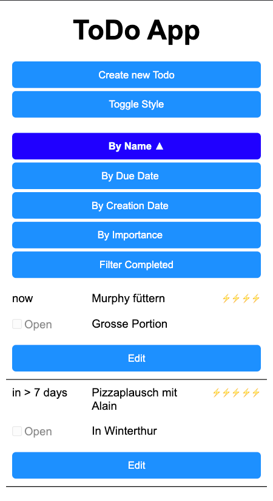

# MAS_WE2_NoteApp

MAS 22-24, WebEngineering 2 Project: Note Web App

## About the Project


Simple ToDo App which was developed as project work in the context of the Web Engineering 2 course by Alain Buri & Sven Zoller.

## Built With

List of major components used to bootstrap the project:

* [![node][node.js]][node-url]
* [![express][express.js]][express-url]

## Getting Started

### Prerequisites

List of things you need to use the software and how to install them.
* npm
  ```sh
  npm install npm@latest -g
  ```

### Installation

1. Clone the repo
   ```sh
   git clone https://github.com/aburi-ost/MAS_WE2_NoteApp.git
   ```
2. Install NPM packages
   ```sh
   npm install
   ```

## Contributing

If you have a suggestion that would make this better, please fork the repo and create a pull request. You can also simply open an issue with the tag "enhancement".
Don't forget to give the project a star! Thanks again!

1. Fork the Project
2. Create your Feature Branch (`git checkout -b feature/AmazingFeature`)
3. Commit your Changes (`git commit -m 'Add some AmazingFeature'`)
4. Push to the Branch (`git push origin feature/AmazingFeature`)
5. Open a Pull Request

## Contact
- Alain Buri - alain.buri@ost.ch
- Sven Zoller - sven.zoller@ost.ch

<!-- MARKDOWN LINKS & IMAGES -->
[node.js]: https://img.shields.io/badge/node.js-6DA55F?style=for-the-badge&logo=node.js&logoColor=white
[node-url]: https://nodejs.org/
[express.js]: https://img.shields.io/badge/express.js-%23404d59.svg?style=for-the-badge&logo=express&logoColor=%2361DAFB
[express-url]: https://expressjs.com
